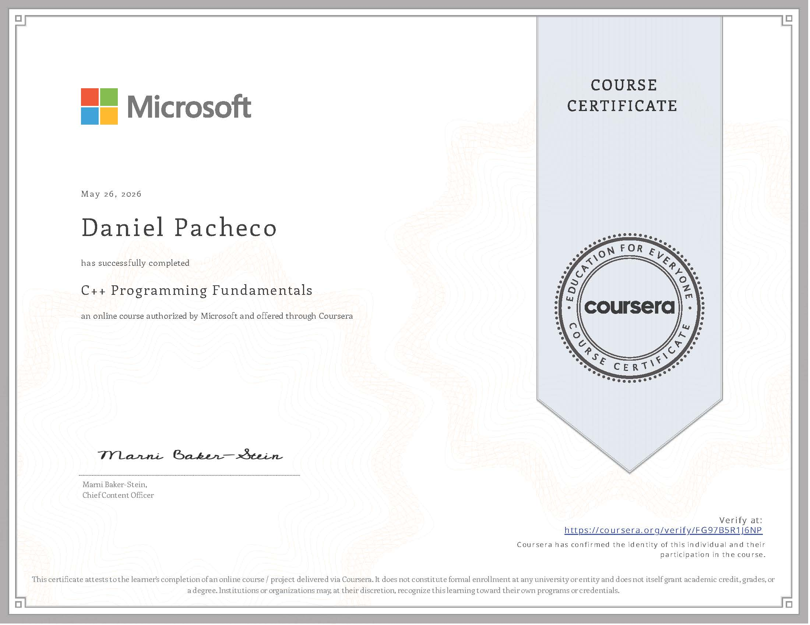
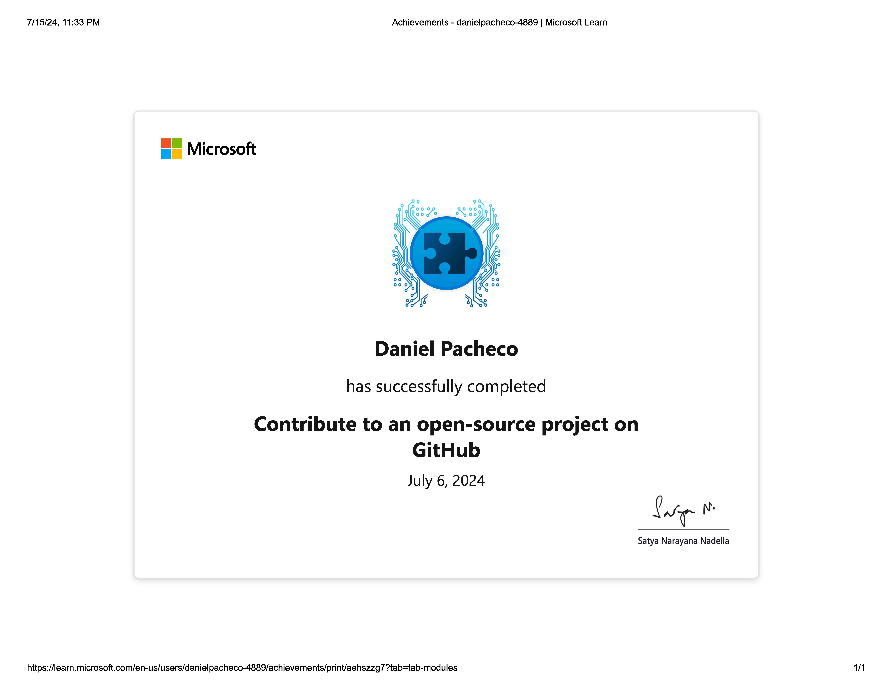
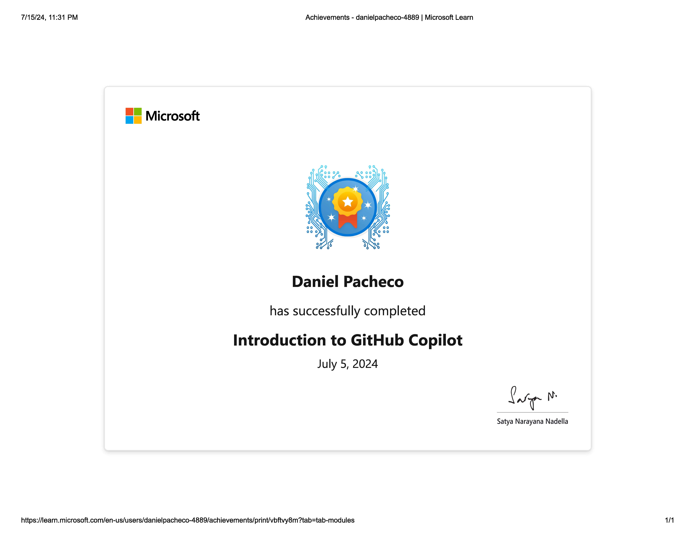
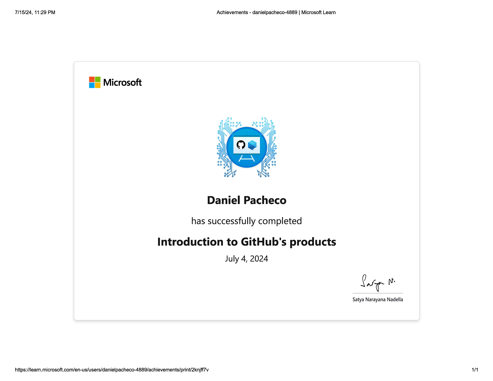
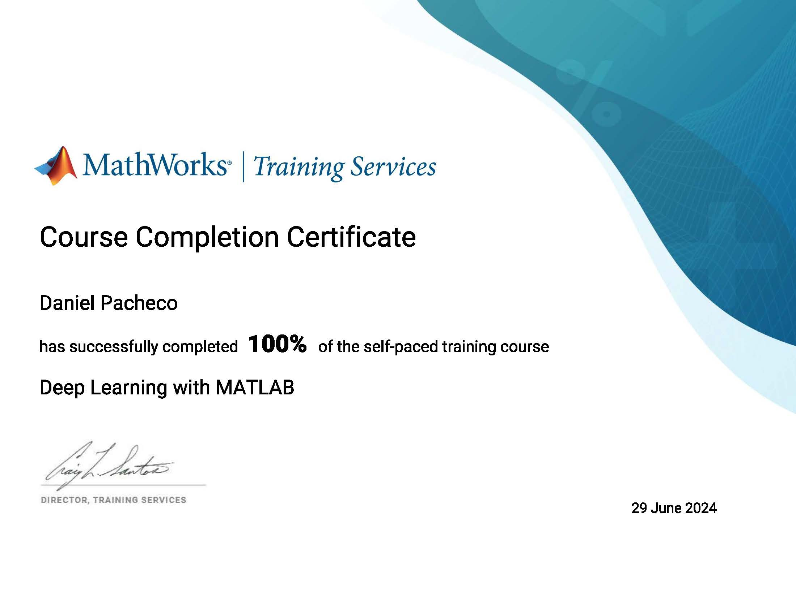
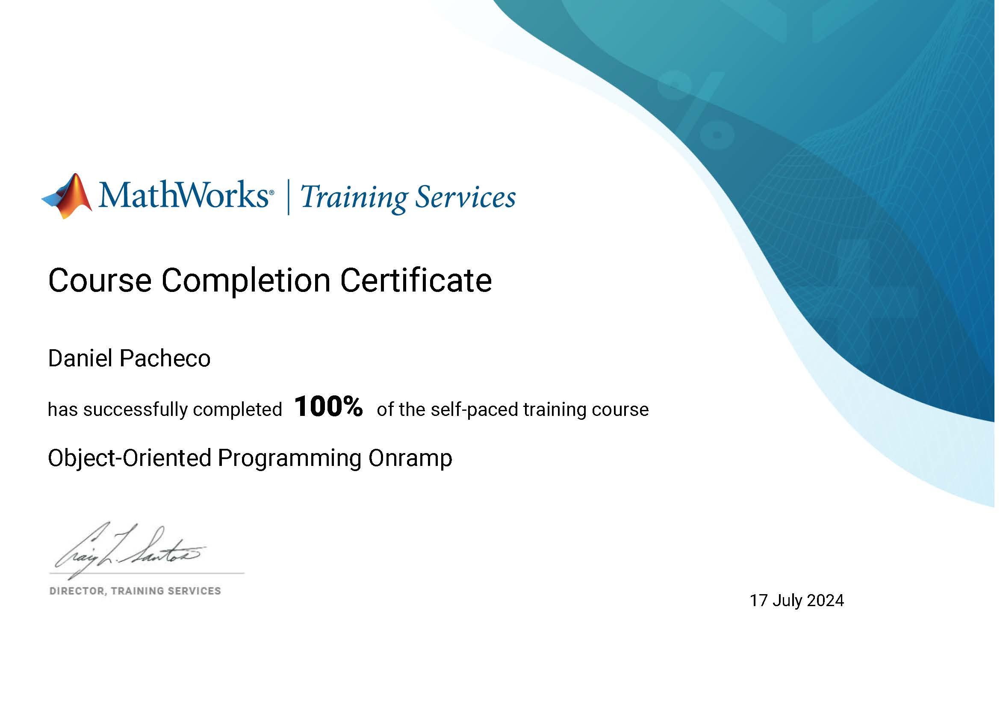

<link rel="stylesheet" href="styles.css">

# Certificates
- C++
- Altium Designer
- Cadence Design Systems
- Github Foundations
- Mathworks

## C++

## Altium Designer (CLICK on the images to learn about what it takes to get certified 😎)

## Cadence Design Systems (CLICK on the images to learn about what it takes to get certified 😎)

## Github Foundations

## Mathworks

