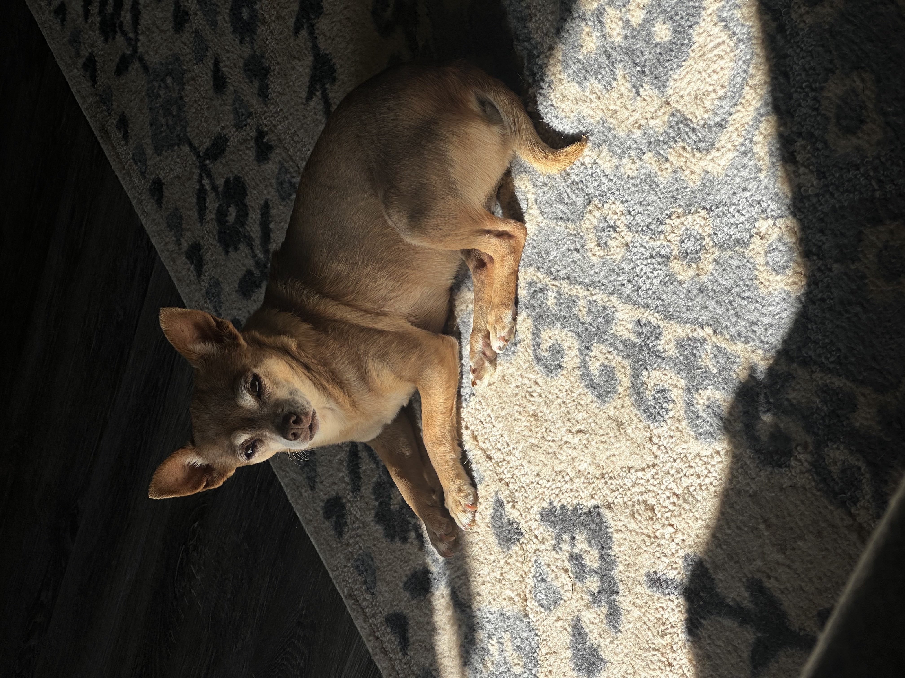

# Hardware Projects

## Welcome to my hardware projects portfolio, where I showcase my hands-on experience with embedded systems, circuit design, and electronic engineering projects developed throughout my electrical engineering career.

## Creating a 2to1 Multiplexor

This project highlights the design and implementation of a 2-to-1 multiplexor in hardware. The multiplexor uses a select line to choose between two input signals and route the selected input to a single output. Through this build, I practiced digital logic design, circuit verification, and hands-on hardware debugging.

    
    

<video controls="controls" width="860" preload="metadata">
    <source src="videos/rocketlaunch.mov" type="video/quicktime">
    Your browser does not support the video tag.
</video>

 

If you want, I can also swap these placeholders with your actual multiplexor photos and video files once you add them to the repo.
